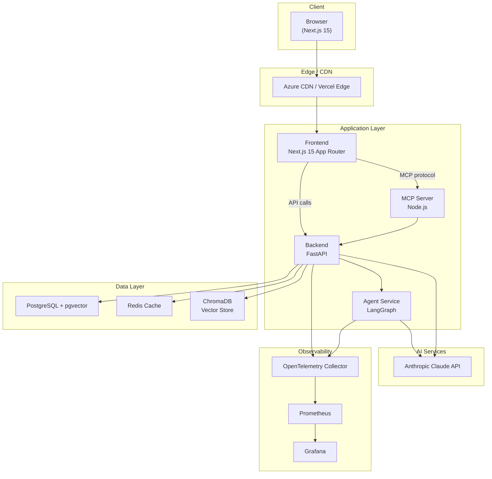

# Architecture Overview

## System Architecture



## Component Descriptions

### Frontend (Next.js 15)
- **App Router** with Server Components for fast initial load
- **Turbopack** for sub-second hot reload in development
- **MUI v6** component library with custom ClaudeTuts theme
- **Code Playground** — Monaco editor + sandboxed Python execution
- **Quiz Engine** — interactive assessments with instant feedback
- **Streaming Chat** — Server-Sent Events for real-time AI responses

### Backend (FastAPI)
- Async Python with FastAPI and SQLAlchemy 2.0
- **Chat endpoint** — proxies to Claude API with streaming support
- **Playground endpoint** — secure sandboxed Python execution via subprocess
- **RAG endpoint** — ChromaDB integration for lesson search
- **Lessons API** — CRUD for lesson metadata
- OpenTelemetry auto-instrumentation

### Agent Service (LangGraph)
- Stateful **Tutor Agent** graph with memory and tool use
- Tools: lesson search, code execution, module info
- Integrates with Claude for natural language understanding
- Redis for agent state persistence

### MCP Server (Node.js + MCP SDK)
- Exposes ClaudeTuts data as MCP **tools** and **resources**
- `search_lessons` tool for semantic lesson retrieval
- `list_modules` tool
- `lesson://` resource URI scheme
- Enables Claude Desktop and other MCP clients to teach from this curriculum

## Data Flow: Lesson Search (RAG)

```
User query
    → Frontend
    → Backend /api/v1/rag/query
    → ChromaDB embedding search
    → Top-K relevant lesson chunks
    → Claude synthesizes answer
    → Streaming response to UI
```

## Security Architecture

- All API routes require HTTPS in production
- CORS restricted to known frontend origins
- User code executed in subprocess with memory limits (64MB) and timeout (10s)
- Anthropic API key stored in Azure Key Vault / GitHub Secrets
- Non-root Docker containers
- Security headers on every response (X-Frame-Options, CSP, etc.)
- Input validation via Pydantic (backend) and Zod (MCP)

## Deployment Architecture

### Local Development
```
docker compose up
```
All services run locally including ChromaDB, PostgreSQL, Redis, Prometheus, and Grafana.

### Production (Azure)
- **Azure Container Apps** for frontend and backend (auto-scaling)
- **Azure Database for PostgreSQL Flexible Server** (managed)
- **Azure Cache for Redis** (managed)
- **Azure Container Registry** (image hosting)
- **GitHub Actions** for CI/CD

## Cost Estimates

### Small Platform (< 100 daily active users)
| Resource | Monthly Cost |
|---|---|
| Azure Container Apps (2x B1) | ~$30 |
| PostgreSQL B_Standard_B1ms | ~$20 |
| Redis Cache C1 | ~$25 |
| Anthropic API (~100K tokens/day) | ~$30 |
| **Total** | **~$105/month** |

### Medium Platform (1,000 daily active users)
| Resource | Monthly Cost |
|---|---|
| Azure Container Apps (4x D2) | ~$200 |
| PostgreSQL Standard D4s | ~$150 |
| Redis Cache C2 | ~$60 |
| Anthropic API (~1M tokens/day) | ~$250 |
| CDN + Bandwidth | ~$40 |
| **Total** | **~$700/month** |

### Large Platform (10,000+ daily active users)
| Resource | Monthly Cost |
|---|---|
| Azure Container Apps (8x+ D4) | ~$800 |
| PostgreSQL Business Critical | ~$600 |
| Redis Cache P1 | ~$200 |
| Anthropic API (~10M tokens/day) | ~$2,000 |
| CDN + Load Balancer | ~$200 |
| **Total** | **~$3,800/month** |
